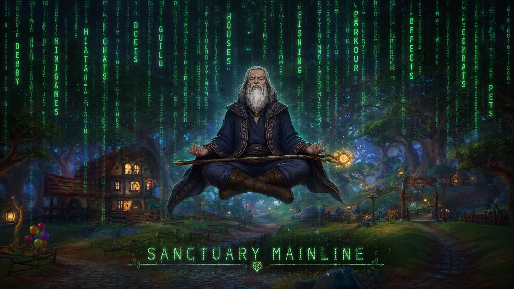

  

# Sanctuary Mainline

**Sanctuary Mainline** is a community-driven **Free Realms server restoration project** focused on rebuilding, testing, and documenting server-side systems for preservation and development purposes.

This project is not just a launcher or a client tool.
It is mainly focused on the server files, service logic, packet behavior, minigame systems, world entry systems, and backend structures required to bring Free Realms features back to life.

Some systems are partially working, some are unstable, and some are currently sleeping inside ancient data files guarded by mysterious GFX rituals.

> Sanctuary is not just a path into the realm.
> It is the machine trying to wake the realm back up.

---

## About Sanctuary Mainline

Sanctuary Mainline focuses on restoring and testing Free Realms server-side functionality.

The project includes research and development around:

* Server files
* Service responses
* Packet handling
* Minigame logic
* TCG service restoration
* Combat system behavior
* World/minigame entry systems
* GFX transitions and summary screens
* Data cache and content loading
* Missing data reconstruction
* Experimental logic for incomplete systems

The goal is to make these systems easier to understand, test, improve, and eventually preserve in a cleaner and more maintainable way.

## Status Legend

| Icon | Meaning                                |
| ---- | -------------------------------------- |
| ✅    | Working / mostly working               |
| ☑️   | Partially working / needs more data    |
| 💤   | Not finished / sleeping / needs work   |
| 🔍   | Active research / investigation        |
| 🔬   | Experimental                           |
| ‼️   | Very unstable / dangerous magical zone |
| ⁉️   | Unknown / mysterious                   |

---

## Development Progress

| Core Systems                                                                                                                                                                                                                                                                                                                                                                                                                                                                                                                                                                                                                                                                   | World / Extra Systems                                                                                                                                                                                                                                                                                                                                                                                                                                                                                                                                                                                                      |
| ------------------------------------------------------------------------------------------------------------------------------------------------------------------------------------------------------------------------------------------------------------------------------------------------------------------------------------------------------------------------------------------------------------------------------------------------------------------------------------------------------------------------------------------------------------------------------------------------------------------------------------------------------------------------------ | -------------------------------------------------------------------------------------------------------------------------------------------------------------------------------------------------------------------------------------------------------------------------------------------------------------------------------------------------------------------------------------------------------------------------------------------------------------------------------------------------------------------------------------------------------------------------------------------------------------------------- |
| **Minigames**    ✅ Checkers   ✅ Chess   💤 Mining  I think I found a small bug, checking it.   💤 Forging   💤 Cooking  A bit unstable, still needs recipe systems.   💤 Harvesting   💤 Smelting   💤 Tower Defense   ☑️ Micro-games   💤 Wheels   💤 Treasure War   💤 Pirates Plunderer   ☑️ Spot the Difference  Still unstable, needs more data.    It looks like each minigame uses its own separate data file or something similar.    I’m preparing a bit of **arcane machine learning magic** to generate estimated data for the missing parts. | **Minigame Worlds**    🔍 Fishing  Worlds are active, but not finished yet.   🔍 Karts  Worlds are active, but not finished yet.   🔍 Derby  Worlds are active, but not finished yet.   💤 Soccer   ⁉️ Battles    There’s also good news from the racing world.    But because approximately seventeen billion extra GFX files are scattered across reality, the race car key may currently exist in another dimension.    It is believed that organizing files properly would anger the ancient tech gods. |
| **Integrated TCG Game**    🔬 Trading Card Game    After a very long silence… the TCG service has finally been reactivated.    The launch gate is open. The native login gate is open.    Now we stand before the mysterious **TCG data cache / content loading** gate.                                                                                                                                                                                                                                                                                                                                               | **Boombox Thing**    🧪 Boombox Packet    I wrote a special packet for the Boombox.    Haven’t tested it yet, but eventually I’ll perform that chaotic ritual too.                                                                                                                                                                                                                                                                                                                                                                                                                 |
| **Combat System**    ‼️ Combat    This place is basically a magical disaster zone.    Archer, Brawler, Medic, Ninja, Warrior… and of course, Wizard.    Right now the combat system is being held together by temporary logic, unstable math, and one suspicious wizard making mysterious noises in the background.                                                                                                                                                                                                                                                                                                   | **Future Systems**    💤 Housing   💤 Pets   💤 Guilds   💤 Marketplace   💤 Social systems    These systems are not the current main focus, but they may be researched later.                                                                                                                                                                                                                                                                                                                                                                                                          |

---

## Launcher Notes

Sanctuary Mainline is also focused on making the Free Realms launcher more reliable for normal users.

Earlier testing showed that installing the launcher or game files directly into `Program Files` may cause permission-related issues on Windows.

Because of this, the launcher is being prepared around an **AppData-based structure** to reduce permission problems and make the setup easier.

Current launcher goals:

* Cleaner installation path
* Fewer Windows permission issues
* Easier setup for non-technical users
* Better file organization
* Future update support
* Dependency checking
* Runtime detection
* Repair options for missing or broken files

---

## Technical Notes

Some restored systems appear to depend on separate data files, GFX files, cache files, or special service responses.

Because of this, some features may appear to open correctly but still fail later during loading, summary screens, content cache checks, or internal game transitions.

In simple terms:

> The gate may open, but the ancient machine behind it may still demand another cursed file.

This is why some features are marked as partially working or unstable.

---

## Current Focus

The current development focus is:

* Testing minigame launch behavior
* Checking missing data requirements
* Improving launcher stability
* Preparing better packaging
* Investigating TCG content loading
* Researching combat system logic
* Testing world-based minigame entries
* Reducing crashes and broken transitions

---

## Disclaimer

Sanctuary Mainline is an independent community project created for Free Realms-related preservation, research, and development purposes.

This project is not affiliated with, endorsed by, or officially connected to Sony Online Entertainment, Daybreak Game Company, or any original Free Realms rights holders.

All Free Realms-related names, assets, and references belong to their respective owners.
